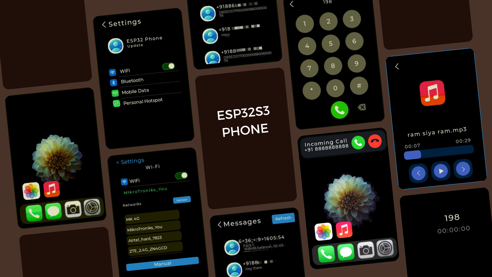
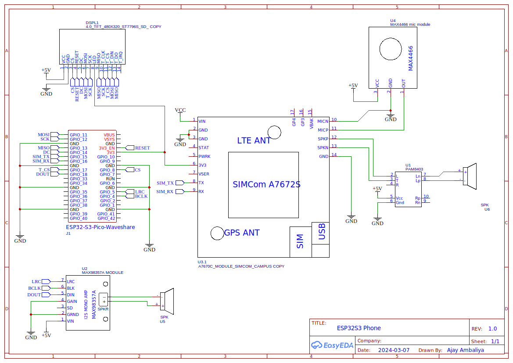

# ESP32-S3 Phone

- Smartphone based on ESP32S3 with SIMCOM, WIFI, Bluetooth and more functions.
- **Visit [ESP32 Phone Website](https://sites.google.com/view/esp32s3phone/home) for complete demo**

## Feature

- [x] WiFi
- [x] Portable Hotspot
- [x] Calls & SMS
- [x] Music Player
- [x] Gallery

## Schematic

## Flashing Guide

- With [esptool-js](https://espressif.github.io/esptool-js/) you can flash ESP32 via web.

    | Location | File               |
    | -------- | ------------------ |
    | 0x0000   | bin/bootloader.bin |
    | 0x8000   | bin/partitions.bin |
    | 0xe000   | bin/boot_app0.bin  |
    | 0x10000  | bin/firmware.bin   |
    | 0x670000 | bin/spiffs.bin     |

## Hardware

| Parts            | Link                                                                                                                                                                                                                     |
| ---------------- | ------------------------------------------------------------------------------------------------------------------------------------------------------------------------------------------------------------------------ |
| ESP32 S3         | [Link](https://www.waveshare.com/esp32-s3-pico.htm)                                                                                                                                                                      |
| SIM A7672s       | [Link](https://www.ktron.in/product/sim-a7672s-4g-2g-lte-development-board/)                                                                                                                                             |
| ST7796           | [Link](http://www.lcdwiki.com/4.0inch_SPI_Module_ST7796)                                                                                                                                                                 |
| MAX98357 I2S Amp | [Link](https://robokits.co.in/sensors/sound/max98357-i2s-3w-class-d-amplifier-interface-audio-decoder-module-filterless-board-for-raspberry-pi-esp32)                                                                    |
| MIC MAX4466      | [Link](https://www.electronicscomp.com/max4466-electret-microphone-amplifier-with-adjustable-gain-module?gad_source=1&gclid=CjwKCAiA6KWvBhAREiwAFPZM7rXsLr3B9vmp1EQP_N32F7jNI7Y1xVai9YDiItXjsKsoMDOqdUk0DBoCO-IQAvD_BwE) |
| PAM8403          | [Link](https://robu.in/product/pam8403-5v-two-channel-stereo-mini-class-d-3w3w-audio-amplifier/)                                                                                                                         |

## Software, IDE & Library

| Item              | Link                                                                                                      |
| ----------------- | --------------------------------------------------------------------------------------------------------- |
| LVGL              | [lvgl](https://github.com/lvgl/lvgl)                                                                      |
| NXP GUIGuider     | [GUIGuider](https://www.nxp.com/design/design-center/software/development-software/gui-guider:GUI-GUIDER) |
| VSCode            | [VSCode](https://code.visualstudio.com/)                                                                  |
| PlatformIO        | [PlatformIO](https://platformio.org/)                                                                     |
| FreeRTOS          | [FreeRTOS](https://www.freertos.org/index.html)                                                           |
| ESP32-audioI2S    | [ESP32-audioI2S](https://github.com/schreibfaul1/ESP32-audioI2S)                                          |
| ESPAsyncWebServer | [ESPAsyncWebServer](https://github.com/me-no-dev/ESPAsyncWebServer)                                       |
| TFT_eSPI          | [TFT_eSPI](https://github.com/Bodmer/TFT_eSPI)                                                            |

## Disclaimer

- This prototype is strictly for educational use and is not for commercial purposes. The iOS-inspired UI is for learning purposes only and is not affiliated with Apple Inc. Respect intellectual property rights and use responsibly.

